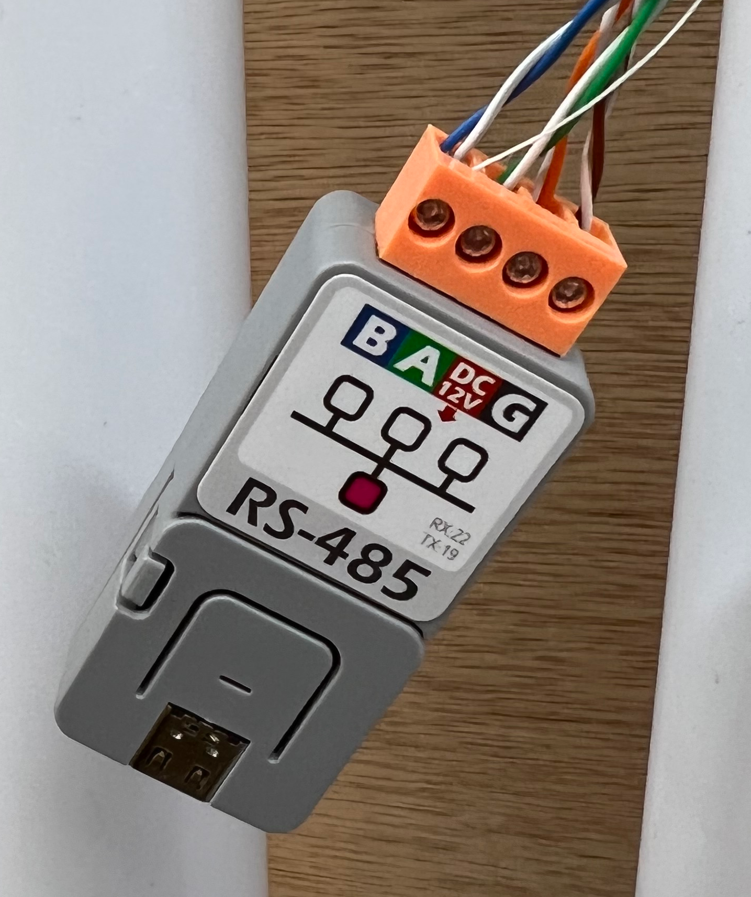

# CenturyVSPump

ESPHome custom component to drive Century (and other) variable speed pump motors

There are a slew of pool pumps that have a super variable speed motor driving
them, and look like they can be controlled by a modbus controller as there is
a connector marked RS485.

I have a Pentair Sta-Rite S5P2R-VS pool pump and looking closely at the pump labels,
I found that this is powered by a Century VS motor which in turn was manufactured by
Regal as a whitelabeled version of their VGreen variable speed motor.

After much hunting around I found this very informative post
https://www.troublefreepool.com/threads/century-regal-vgreen-motor-automation.238733/

While that post is really about how to make the VGreen motor talk the Jandy protocol so
that the pump can be controlled from an existing system, my interest was piqued because
during that process, the pump is placed into a Modbus protocol mode which was something
that I was very interested in.

You can identify these pumps as they have two automation compatible interfaces, the RS485
one and a 5-wire connector that allows remote control of the three preset speeds or the
override speed.

There is also a 5-way DIP switch that controls how the pump firmware behaves, and this
is key to driving the pump.

The critical switch is #1 which determines if the pump talks the Modbus commands
(in the OFF position), or if it talks the OEM protocol (in the ON position).

The RS485 interface also has a modest 12V power line which I was also very pleased about
as I could use it to power this fantastic little ESP32 device without the need for any
other external power source. Indeed, a good way to determine if you're selected on the
Modbus protocol is that the 12V line is only live when DIP switch #1 is off and so this
little device wont be powered otherwise.

# Keywords

Shameless list of keywords to help other folk find this repo.

- Pentair

# Information sources
